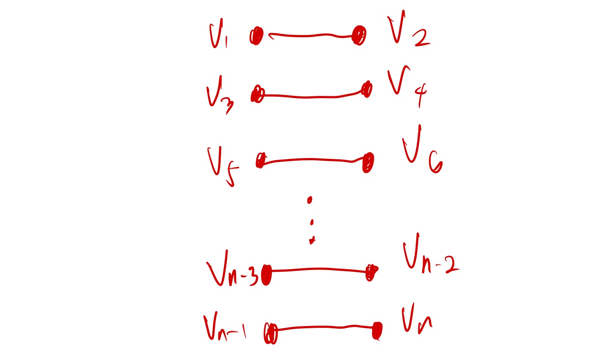
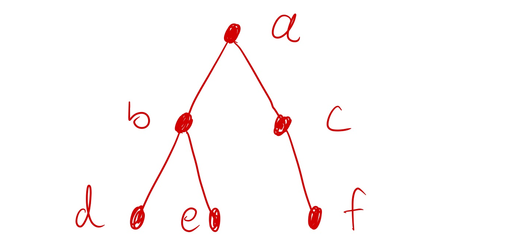

# CMSC 57 Mock Exam

Some questions will require you apply concepts to find identities or find false statements, such as the question below.

> 1. Given events $E$ and $F$ within the sample space $S$, where every outcome in are equally likely, which of the following is true?
>
>    a. $p(E \cap F) \leq p(E)$
>
>    b. $p(E)\neq p(\overline{E})$
>
>    c. $p(E |F) = p(F|E)$
>
>    d. None of the above 

In some questions, you simply apply concepts to solve problems like the question below

> 2. Which of the following events are more likely?
>
>    a. Rolling at at least 3 sixes in 5 dice rolls
>
>    b. Rolling all heads or all tails after 8 coin flips
>
>    c. $p(Q|R)$, given $p(Q \cap R) = 0.05$ and $p(Q)=0.3$ and $p(R)=0.35$
>
>    d.$b(4;8,0.3)$

Some questions may involve graphs or trees in a generalized form

> 3. Given a simple undirected graph $G=(V,E)$ where $n$ is even, $V = \{v_1,...,v_n\}$ and $E = \{\{v_1,v_2\} ,\{v_3,v_4\},...,\{v_5,v_6\},\{v_{n-1},v_n\}\}$. What is the degree weight of $G$?
>
>    a. $|V|$
>
>    b. $2|V|$
>
>    c. $|E|$
>
>    d. None of the above

In some questions you will combine multiple concepts to find the correct answer

> 4. Given the following tree, with the vertices $\{a,b,c,d,e,f\}$ and the following family specifications:
>
>    $a$ is the root, it's children are $b$ and $c$.
>
>    $b$'s children are $d$ and $e$.
>
>    c's only child is $f$.
>
>    Which of the following are correct traversals of the tree?
>
>    a. preorder: a,b,d,c,e,f; postorder: d,e,b,f,c,a
>
>    b. preorder: a,b,d,e,c,f; postorder: d,e,b,f,c,a
>
>    c. preorder: a,b,d,c,e,f; postorder: d,b,e,f,c,a
>
>    d. preorder: a,b,c,d,e,f; postorder: d,b,e,f,c,a
>

# Answers

1. You need to apply probability theory concepts to find the true identity. **Choice a is true** since $E \cap F$ is always subset of $E$. Therefore, you are sure that $E \cap F$ has less or the same amount of elements as $E$ (It can only have the same amount as $E$ if and only if $E=F$). You can make the conclusion that $|E\cap F| \leq |E|$ which implies $\frac{|E \cap F|}{|S|} \leq \frac{|E|}{|S|}$ and $p(E \cap F) \leq p(E)$. 

   Choice b is false given counterexample $p(E) = 0.5$ which implies $1-p(E) = 1 - 0.5 = 0.5 = p(E)$. 

   Choice c is not true for all cases where $p(E) \neq p(F)$. On these cases $\frac{p(E \cap F)}{ p(F)}$ and $\frac{p(E \cap F)}{ p(E)}$ have different denominators. Which means $\frac{p(E \cap F)}{ p(F)} \neq \frac{p(E \cap F)}{ p(E)}$ and $p(E|F) \neq p(F|E)$.

2. You simply solve for the probabilities for each choice:

   - Choice a: given rolling a dice as trial and denoting rolling a three as a success outcome, you can solve for this probability as $b(3;5,\frac{1}{6})+b(4;5,\frac{1}{6})+b(5;5,\frac{1}{6}) \approx 0.03215 + 0.00322 + 0.00013 \approx 0.03549$
   - Choice b: The number of unique outcomes in eight coin flips can be counted using the product rule as $2^8$. There is only one outcome out of the sample space where you flip 8 heads. Therefore the probability is calculated as $\frac{1}{2^8}\approx 0.004$.
   - **Choice c:** The conditional probability $p(Q|R) = \frac{p(Q \cap R)}{R} = \frac{0.05}{0.35} = \approx 0.14$
   - Choice d: $b(4;8,0.3)={8 \choose 4}0.3^4 0.7^4 \approx 0.13614$

3. When drawing the graph you will notice that the graph consists of $n$ vertices and$\frac{n}{2}$ edges. 

   

   The formula of degree weight is $2|E|$. Since $|E| = \frac{n}{2}$, the degree weight is $n$, which is the number of vertices. Therefore **the correct answer is a**.

4. Construct the tree using the specifications provided:

   

With these example only one choice has valid preorder and postorder traversal, **choice b**.

- choice a is invalid since a,b,d,c,e,f is not a valid depth first traversal, vertex e cannot come after c in this traversal. the left subtree must be completely traversed before traversing vertices in the right
- Choice c is invalid for the same reason above and also the postorder is invalid
- Choice d is invalid since a,b,c,d,e,f, is not depth first

