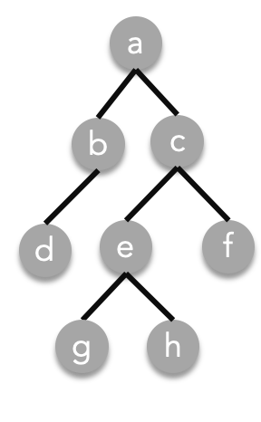

# Seatwork (Trees)

1. Arrange the nodes from $T$ according to breadth first traversal, first visited to last visited

2. Arrange the nodes from $T$ according to preorder traversal, first visited to last visited

3. Arrange the nodes from $T$ according to postorder traversal, first visited to last visited

4. Arrange the nodes from $T$ according to inorder traversal, first visited to last visited

5. Draw the spanning tree formed by a complete graph with 4 vertices using breadth first traversal

6. Draw the spanning tree formed by a complete graph with 4 vertices using depth first traversal

7. Given the following undirected graph $G$, represented by the following weighted adjacency matrix:
   $$
   \begin{bmatrix}
   0&1&2&0&3&2\\
   1&0&0&2&1&1\\
   2&0&0&0&1&0\\
   0&2&0&0&0&2\\
   3&1&1&0&0&1\\
   2&1&0&2&1&0
   \end{bmatrix}
   $$
   In this adjacency matrix, the value of an element represents the weight of the corresponding edge. Any edge $\{v_i,v_j\}$ with weight $u$, implies that the element $A_{ij} = u$ in the adjacency matrix.

   List all of the edges of one minimum spanning tree from $G$. 